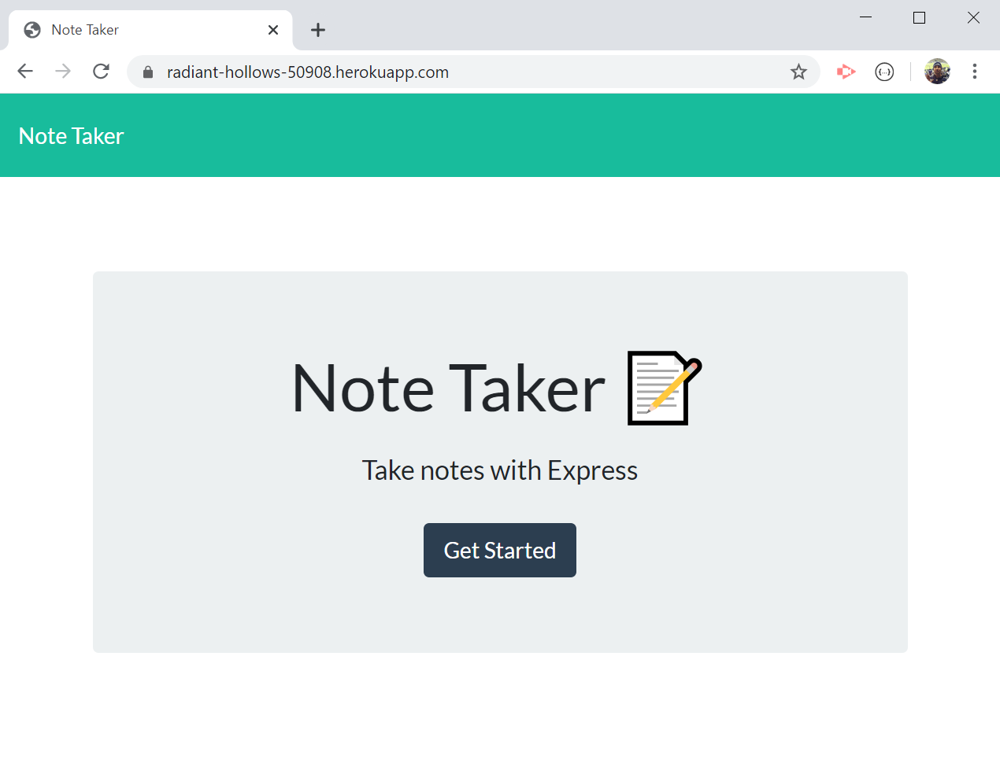
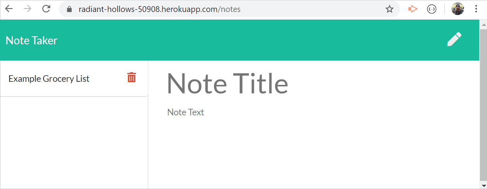
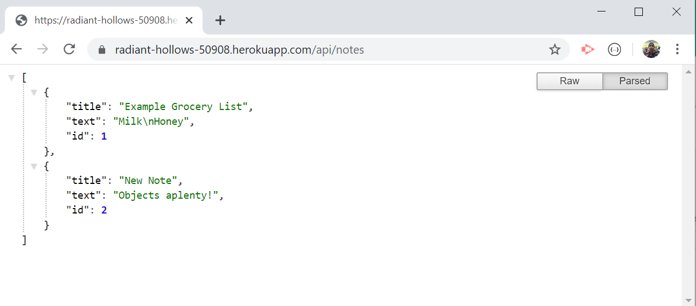
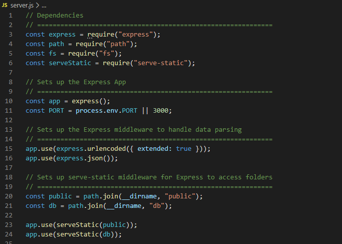
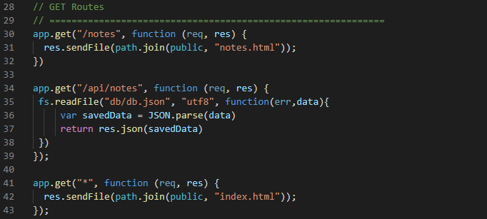
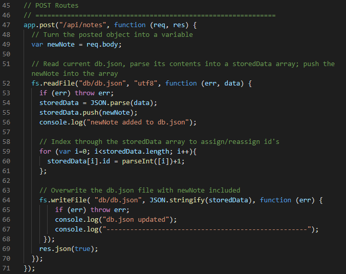
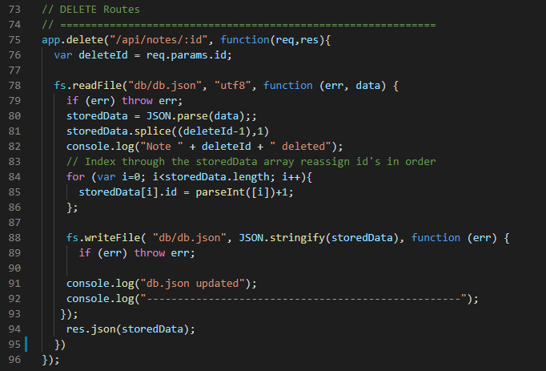

# Express Note Taker

Jeffrey Adamo  
UW Full Stack BootCamp  
[Express Note Taker repo at GitHub Pages  ](https://jeffreyadamo.github.io/Express_NoteTaker/)  

  
***

## Description

This app features the use of express.js as middleware in [server.js](/server.js) to help write a series of GET, POST, and DELETE routes to render the Note Taker application functional. Users at https://radiant-hollows-50908.herokuapp.com/ are greeted with a functioning server running the app. The user can navigate to the [notes](https://radiant-hollows-50908.herokuapp.com/notes) page to begin   saving new notes, viewing and deleting any saved notes. Notes are saved and edited on db.json as a flat file server viewable at [api/notes](https://radiant-hollows-50908.herokuapp.com/api/notes).  


  

This app features the following fundamentals:
* Express.js middleware
* Node server
* Heroku server
* ServeStatic middleware

## Table of Contents

* [Installation](#installation)

* [Usage](#usage)

* [Contributing](#contributing)

* [Tests](#tests)

* [Questions/Contributions](#questions/contributions)

## Installation

### For local hosting, users can clone the GitHub repository by running the following command on the command prompt:
```
git clone https://github.com/jeffreyadamo/Express_NoteTaker.git
```
### Please run the following command to install dependencies:

```
npm i
```

## Usage
### User Story
```
AS A user, I want to be able to write and save notes

I WANT to be able to delete notes I've written before

SO THAT I can organize my thoughts and keep track of tasks I need to complete
```
Visit https://radiant-hollows-50908.herokuapp.com/ and click on "Get Started" link.  

  


Write new notes by selecting "Note Title" and/or "Note Text" fields. A save button will become activated in the navigation bar when the user has input data for both fields.  

  

Saving the note will render a shortcut to the left side of the page that can be selected to display the full body of the note. The user can delete the note from by selecting the trash icon.  

This application is designed as a flat file server, so all notes are stored as an object in db.json. Visit https://radiant-hollows-50908.herokuapp.com/api/notes to view json file.  

 

The magic for this app exists in server.js where dependencies packages for middleware are established. serveStatic middleware to call up html files stored in the public folder and the db.json file stored in the db folder:

  

We are utilizing Express GET, POST, and DELETE routes in this application.  
GET routes point to html stored in public folder where the db.json can be read using the fs package.

  

POST routes are established and an "id" is assigned to each note saved by indexing through the db.json array. 

* Lines 59-61 took me the longest to figure out the proper way to index the object in order the functions defined in index.js to work properly

  

DELETE routes are established and the fs package is used to update db.json:
* db.json is read and parsed into an object
* .splice() is used to delete the id specified by the user
* "id" is reestablished using the indexing loop in the POST method
* db.json is overwritten with new spliced object

  

Local hosting is available after installing dependencies by running the following on the command line:
```
node server.js
```
...visit localhost:3000 in the browser to use application.

## Tests
```
none
```

## Questions/Contributions

For questions or comments about this app, open an issue or contact my GitHub  


    

@ [jeffreyadamo](http://www.github.com/jeffreyadamo)  

Cheers!

 